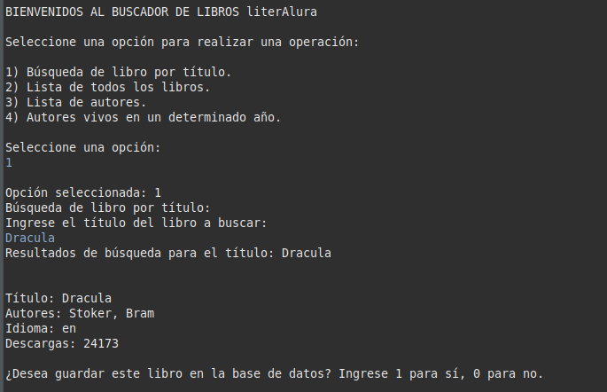

# Buscador de Libros literAlura

## Índice

- [Estado del Proyecto](#estado-del-proyecto)
- [Descripción](#descripción)
- [Funcionalidades](#funcionalidades)
- [Instrucciones](#instrucciones)
- [Requisitos](#requisitos)
- [Tecnologías Utilizadas](#tecnologías-utilizadas)
- [Ayuda y Documentación](#ayuda-y-documentación)
- [Autor](#autor)

## Estado del Proyecto

Back-end finalizado, con futuras mejoras y optimizaciones planeadas.

## Descripción

Este proyecto es un desafío propuesto durante mi formación académica en Alura Latam en asociación con Oracle Education. La aplicación realizada permite interactuar con una API para buscar libros, listarlos, y realizar acciones como filtrar por autores, contar libros por idioma, y más.

La aplicación permite a los usuarios:

- Buscar libros por título.
- Listar todos los libros disponibles.
- Obtener una lista de autores.
- Ver qué autores están vivos en un año específico.
- Contar la cantidad de libros en un idioma específico.
- Guardar libros y autores en la base de datos local.

## Funcionalidades

La aplicación permite realizar las siguientes acciones a través de un menú interactivo:

- **Búsqueda de libro por título**: Permite ingresar un título y buscar los libros que coincidan con él.
- **Listar todos los libros**: Muestra una lista de todos los libros disponibles.
- **Listar autores**: Muestra los autores disponibles en la base de datos de libros.
- **Listar autores vivos en un año específico**: Permite ingresar un año y listar los autores vivos en ese año.
- **Contar libros por idioma**: Permite contar cuántos libros están disponibles en un idioma específico.

Los usuarios también pueden guardar libros y autores en una base de datos local para consultas futuras.

## Instrucciones

### Acceso al Proyecto

1. Clonar o descargar este repositorio desde GitHub.
2. Descargar e instalar un editor de texto o IDE, como Eclipse.
3. Abrir el proyecto en el IDE.
4. Ejecutar el programa desde la consola, interactuando con las opciones ofrecidas.

### Uso de la Aplicación

1. Al ejecutar la aplicación, se mostrará un menú con varias opciones para interactuar.
2. Seleccionar una opción del menú (por ejemplo, buscar un libro por título o listar autores).
3. Seguir las instrucciones en pantalla para realizar la operación deseada.

### Ejemplo de uso: Buscar libro por título

#### Opción 1: Buscar libro por título

- Ingrese el título del libro a buscar, como "Moby Dick".
- La aplicación buscará el libro y devolverá la información relevante.
- Después de mostrar la información, preguntará si desea guardar el libro en la base de datos. Ingrese 1 para guardar o 0 para no guardar.

#### 

#### 

#### Opción 1: Buscar libro por título

- Ingrese el título del libro a buscar, como "Moby Dick".
- La aplicación buscará el libro y devolverá la información relevante.
- Después de mostrar la información, preguntará si desea guardar el libro en la base de datos. Ingrese 1 para guardar o 0 para no guardar.

## Requisitos

- **Java 11 o superior** instalado en el sistema.
- **Conexión activa a internet** para consumir la API externa de libros.
- **IDE como Eclipse** para ejecutar el proyecto.

## Tecnologías Utilizadas

- **JDK (Java Development Kit)**: Herramienta principal para ejecutar programas en Java.
- **Spring Boot**: Framework para la creación de aplicaciones Java basadas en Spring.
- **Jackson**: Librería para manipulación de datos en formato JSON.
- **Eclipse IDE**: Entorno de desarrollo integrado utilizado para programar el proyecto.
- **PostgreSQL**: Base de datos utilizada para guardar libros y autores.

## Ayuda y Documentación

Para más información sobre el funcionamiento de la API utilizada en este proyecto, consulta el sitio web del [Proyecto Gutenberg](https://www.gutenberg.org/) para acceder a la documentación oficial.

## Autor

Proyecto desarrollado por **Martin Lorenzi**.  
Contacto: [alexmartin9c@gmail.com](mailto:alexmartin9c@gmail.com)

